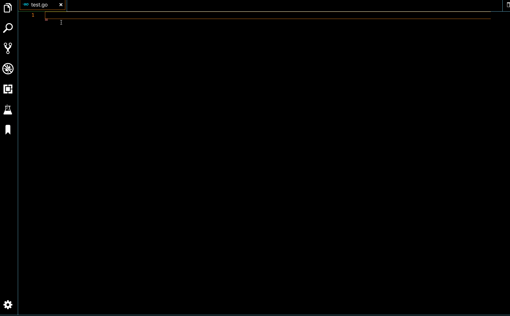
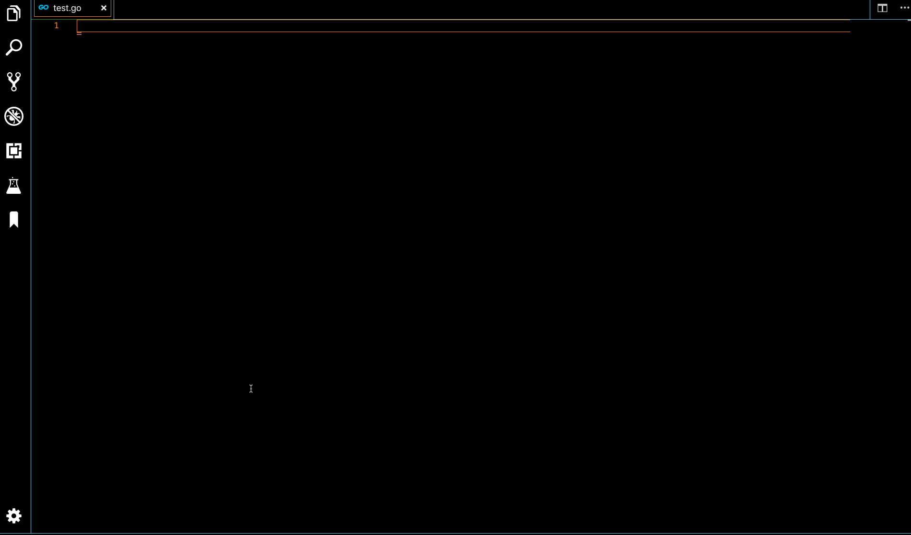
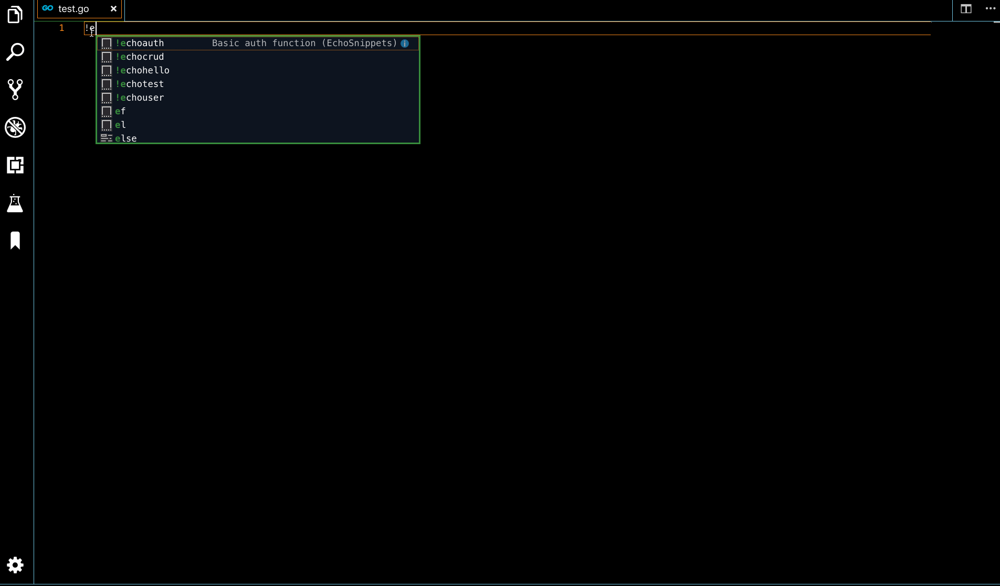

# EchoSnippets 

EchoSnippets helps developers to utilized Go Echo framework faster by generating snippets.

## Snippet Menu

`!echouser` >> generates basic user struct 

  

`!echohello` >> generates ready-to-go "Hello World" Echo  app

  

`!echocrud` >> generates basic CRUD functions, middlewares and routes

  

`!echoauth` >> generates basic auth function

  

`!echotest` >> generates basic test function setups

  

## Installation and Usage

1. Install and open [Visual Studio Code](https://code.visualstudio.com/).
2.  Press `Ctrl+Shift+X` (on Linux and Windows) or `Cmd+Shift+X` (on macOS) to open the Extension panel.
3.  Find and install EchoSnippets extension. You can also find EchoSnippets at [Marketplace](https://marketplace.visualstudio.com/items?itemName=Makhmud.echosnippets)
4. Reload VS Code
5. Open any `.go` file in VS Code. EchoSnippets is now activated

### Version 1.2.1
The following additional snippets were added:
- boilerplate function for basic authentication
- snippet for basic route testing function setups

### Version 1.0.0

Initial release of EchoSnippets include 3 snippets:
- basic user model
- basic hello world app
- basic crud functions, middlewares and routes

